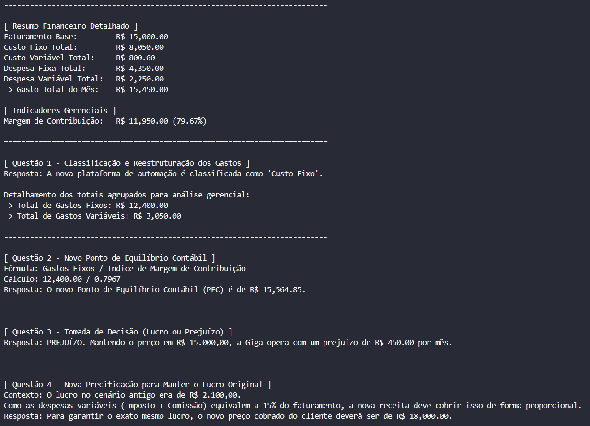
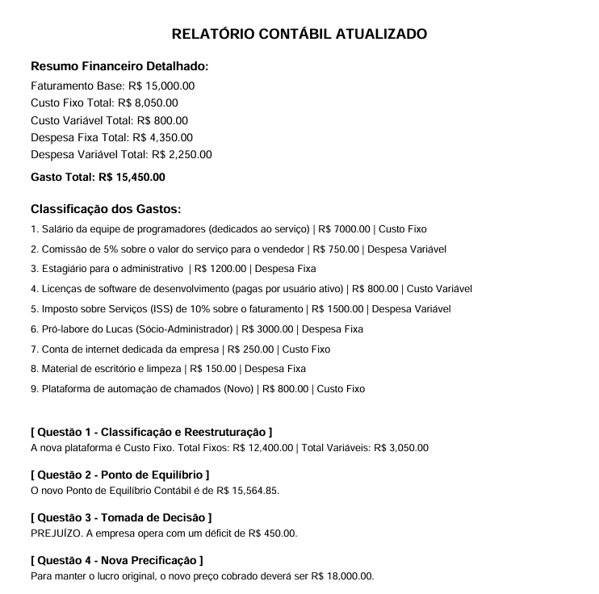

# Sistema de Classificação Contábil de gastos - Empresa Giga (Cenário Expandido)

Este repositório contém um algoritmo desenvolvido em Python focado na automação de análises contábeis e geração de relatórios gerenciais estruturados (via terminal e arquivo PDF). O objetivo principal do projeto é avaliar o impacto financeiro da expansão operacional da Empresa Giga e fornecer suporte à tomada de decisões estratégicas de precificação.

Os dados da Empresa Giga são a continuidade do projeto anterior, disponível no repositório [Contabilidade Gastos Python](https://github.com/anibele/Contabilidade-Gastos-Python-).

---

## 1. Contexto e Escolhas Contábeis

A estruturação deste algoritmo baseia-se nos preceitos da **Contabilidade Gerencial**, especificamente no método de **Custeio Variável**. Abaixo estão detalhadas as premissas e classificações adotadas pelo sistema:

### Classificação Inicial: Custo vs. Despesa
* **Custos:** Gastos diretamente vinculados à atividade-fim da empresa (prestação do serviço tecnológico). Exemplos: salários da equipe de programadores dedicados e licenças de softwares de desenvolvimento.
* **Despesas:** Gastos associados à estrutura administrativa, comercial e de suporte geral que não geram diretamente o serviço, mas mantêm a empresa operando. Exemplos: pró-labore do sócio-administrador, salário do estagiário do administrativo e comissões de vendas.

### Classificação Operacional: Fixo vs. Variável
* **Gastos Fixos (Custos e Despesas):** Valores que independem do volume de vendas ou do nível de faturamento da empresa. Permanecem estáveis no curto prazo. 
  * *Decisão Estratégica:* A inclusão da **nova plataforma de automação de chamados** (R$ 800,00) foi tratada rigorosamente como **Custo Fixo**. Embora seja uma ferramenta de suporte, seu valor é cobrado por assinatura mensal fixa e não oscila proporcionalmente ao faturamento obtido.
* **Gastos Variáveis (Custos e Despesas):** Valores que alteram-se em proporção direta ao volume de serviços vendidos ou faturamento gerado. Exemplos: Imposto sobre Serviços (ISS) e comissões dos vendedores (ambos vinculados a um percentual do faturamento).

---

## 2. Explicação das Fórmulas Aplicadas

O algoritmo executa de forma automatizada quatro grandes cálculos gerenciais para avaliar a saúde financeira da empresa:

### A. Margem de Contribuição (MC)
Mede o quanto sobra das vendas para cobrir os gastos fixos e gerar o lucro líquido após a dedução das despesas e custos variáveis.
* **Fórmula em Valor ($):** $$\text{Margem de Contribuição} = \text{Faturamento} - \text{Total de Gastos Variáveis}$$
* **Fórmula Percentual (%):** $$\text{Índice de MC} = \frac{\text{Margem de Contribuição (Valor)}}{\text{Faturamento}}$$

### B. Ponto de Equilíbrio Contábil (PEC)
Indica o faturamento mínimo que a empresa precisa atingir para cobrir todos os seus gastos fixos e variáveis, resultando em um lucro operacional exatamente igual a zero (ponto de empate).
* **Fórmula:** $$\text{PEC} = \frac{\text{Total de Gastos Fixos}}{\text{Índice de MC}}$$

### C. Resultado Operacional
Determina o lucro real ou prejuízo do período após confrontar todas as entradas com a totalidade das saídas de caixa operacionais.
* **Fórmula:** $$\text{Resultado} = \text{Faturamento} - (\text{Total de Gastos Fixos} + \text{Total de Gastos Variáveis})$$

### D. Nova Precificação Target (Preço Alvo)
Calcula a nova receita necessária para restabelecer o lucro original do cenário antigo (R$ 2.100,00), absorvendo o aumento dos custos fixos e considerando o impacto em cascata dos gastos que flutuam baseados no faturamento (Imposto + Comissão = 15%).
* **Fórmula:** $$\text{Preço Alvo} = \frac{\text{Gastos Fixos} + \text{Licenças Fixas} + \text{Lucro Alvo}}{1 - \text{Percentual de Gastos Variáveis}}$$
  $$\text{Preço Alvo} = \frac{12.400,00 + 800,00 + 2.100,00}{1 - 0.15} = \frac{15.300,00}{0.85} = R\$ 18.000,00$$

---

## 3. Explicação Resumida do Algoritmo

O programa funciona como uma esteira de dados. Ele lê uma planilha de dados atualizada, limpa as strings de moeda para transformá-las em números operáveis, classifica cada linha dinamicamente usando varredura por palavras-chave e armazena as informações estruturadas em memória. A partir daí, centraliza os cálculos estatísticos e aciona os canais de saída (Terminal ou PDF) baseando-se na escolha do usuário.

---

## 4. O que cada Função faz

* `analisar_e_classificar(descricao)`: Atua como o motor lógico de classificação contábil. Varre o texto da descrição utilizando estruturas condicionais e chaves léxicas para definir se o item pertence às categorias Fixo ou Variável.
* `carregar_dados(caminho)`: Responsável pelo I/O de dados. Abre a planilha Excel, isola as colunas de texto e valores, realiza o tratamento de caracteres especiais e strings de moeda (`R$`), converte-as para tipo numérico flutuante (`float`) e possui um banco interno de contingência caso o arquivo original falhe.
* `classificar_operacionalmente(contas)`: Segrega e distribui os itens mapeados em dicionários de vetores focados no seu comportamento operacional (`fixos` ou `variaveis`).
* `calcular_indicadores(balanco)`: Centraliza todas as fórmulas contábeis do sistema. Garante que os números apresentados no terminal e impressos no documento PDF sejam perfeitamente idênticos.
* `exibir_relatorio_contabil(dados_brutos, balanco)`: Formata e exibe em texto estruturado os indicadores gerenciais e a resolução detalhada das quatro questões de análise na tela do terminal.
* `gerar_pdf(dados_brutos, balanco)`: Instancia um documento A4 via biblioteca geradora, mapeia a largura útil da página para blindar quebras de linha abruptas e escreve o relatório oficial devidamente diagramado e espaçado.
* `menu()`: Desenha a interface interativa no terminal capturando as entradas do usuário e controlando os fluxos de execução do programa.

---

## 5. Opções do Menu

1. **1 - Mostrar Resultados do Novo Cenário:** Realiza a leitura e imprime o painel de indicadores gerenciais estruturados em formato de texto diretamente na tela do console.
2. **2 - Gerar Relatório em PDF:** Gera e exporta na raiz do projeto o arquivo `Relatorio_Financeiro_Giga.pdf` com layout protegido contra sobreposição de fontes e codificado para aceitar caracteres da língua portuguesa.
3. **3 - Sair do Sistema:** Encerra os loops ativos do algoritmo e finaliza o processo em execução com segurança.

---

## 6. Pré-requisitos de Instalação

Para executar este script com sucesso, certifique-se de que seu ambiente Python possua as seguintes dependências instaladas:
pip install pandas openpyxl fpdf2
- Aviso de Compatibilidade: O projeto utiliza o fpdf2 moderno. Certifique-se de desinstalar versões antigas e conflitantes como o pypdf ou fpdf legados (pip uninstall pypdf fpdf) antes de prosseguir para evitar erros de namespace.

## 7. Resultados do Sistema

Abaixo estão os registros visuais do funcionamento e das saídas geradas pela aplicação:

### Saída Executada no Terminal

### Documento PDF Gerado

